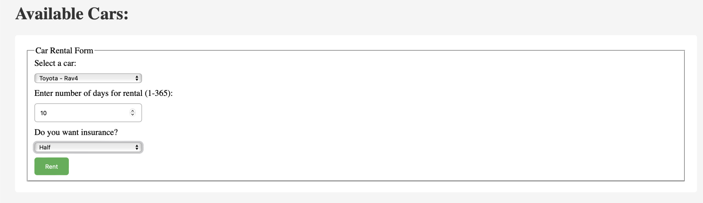
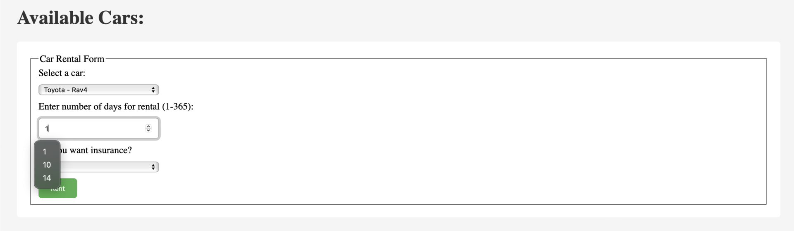
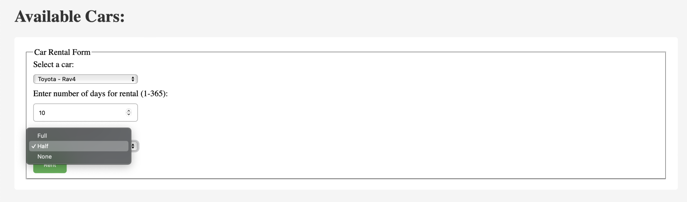
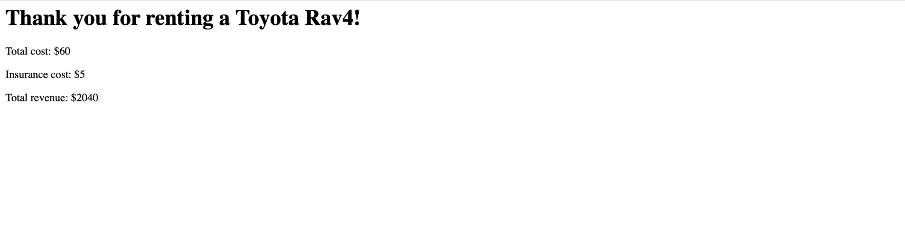

# Car Rental Project
This project is a car rental system designed to manage the rental process for vehicles. It allows users to:

1) Browse and search for available cars based on criteria like car brand, model.
2) View car details and pricing information.

# Technologies Used:
 - Utilized Python and HTML with Flask framework for this project.

## Visual Overview
 
 
